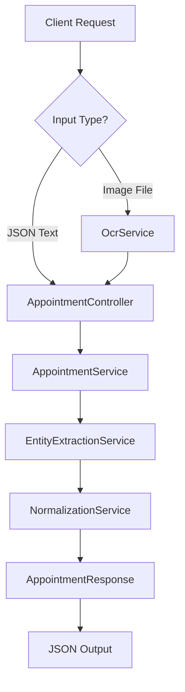
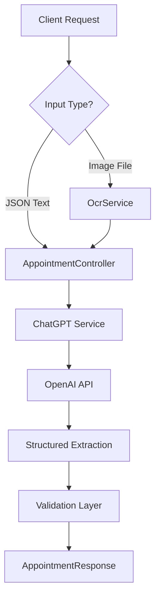

# AI Appointment Scheduler

> A backend service that transforms natural language and document-based appointment requests into structured scheduling data through OCR and NLP processing.

[](https://www.oracle.com/java/)
[](https://spring.io/projects/spring-boot)

---

## Table of Contents

- [Overview](#-overview)
- [Architecture](#-architecture)
- [Technology Stack](#-technology-stack)
- [API Endpoints](#-api-endpoints)
- [Guardrails and Validation](#-guardrails-and-validation)
- [Getting Started](#-getting-started)
- [Usage Examples](#-usage-examples)
- [Testing](#-testing)
- [Project Structure](#-project-structure)
- [Design Decisions](#-design-decisions)
- [Alternative Approach](#-alternative-approach)
- [Future Enhancements](#-future-enhancements)

---

## Overview

The **AI Appointment Scheduler** is a backend service designed to parse both **text-based** and **image-based** appointment requests and convert them into structured JSON output.


This system automates the extraction, parsing, and normalization of such data into a standardized format.

---
## Architecture

The system follows a **layered service architecture** with clear separation of concerns:



### Processing Pipeline

1. **Input Layer**: REST Controller accepts JSON or multipart/form-data
2. **OCR Layer**: Tesseract extracts text from images
3. **Entity Extraction**: PrettyTime NLP parses dates/times; regex extracts departments
4. **Validation**: Checks for explicit date/time and required fields
5. **Normalization**: Converts to standard formats and timezone
6. **Response**: Returns structured JSON with status and appointment details

---

## Technology Stack

| Component | Technology       | Purpose |
|-----------|------------------|---------|
| **Framework** | Spring Boot      | REST API development |
| **Language** | Java 21          | Core programming language |
| **OCR Engine** | Tesseract        | Optical Character Recognition |
| **NLP Parser** | PrettyTime NLP   | Natural language date/time parsing |
| **Validation** | Spring Validation | Input validation |

---

## API Endpoints

### **1. Parse Text Appointment**

**Endpoint**: `POST /api/parse`  
**Content-Type**: `application/json`

#### Request Schema
```json
{
  "text": "string (required)"  // Natural language appointment request
}
```

#### Response Schema
```json
{
  "status": "string",           // "ok" or "needs_clarification"
  "appointment": {
    "date": "string",           // Format: YYYY-MM-DD
    "time": "string",           // Format: HH:mm (24-hour)
    "tz": "string",             // Timezone identifier
    "department": "string"      // Capitalized department name
  },
  "message": "string | null"   // Error/clarification message
}
```

#### Example Request
```json
{
  "text": "Book a dentist appointment for tomorrow at 3 PM"
}
```

#### Success Response (200 OK)
```json
{
  "status": "ok",
  "appointment": {
    "date": "2025-12-04",
    "time": "15:00",
    "tz": "Asia/Kolkata",
    "department": "Dentist"
  },
  "message": null
}
```

#### Ambiguous Input Response (200 OK)
```json
{
  "status": "needs_clarification",
  "appointment": null,
  "message": "Ambiguous date/time or department"
}
```

---

### **2. Parse Image Appointment**

**Endpoint**: `POST /api/parse`  
**Content-Type**: `multipart/form-data`

**Request**: Upload an image file containing appointment details

**CURL Example**:
```bash
curl -X POST http://localhost:8080/api/parse \
  -F "file=@appointment.jpg"
```

**Response**: Same format as text endpoint

---

## Guardrails and Validation

The system implements multiple layers of validation to ensure data quality:

### Input Validation
- **File Type Checking**: Validates image file formats (JPEG, PNG, etc.)
- **File Size Limits**: Prevents oversized uploads
- **Content Validation**: Ensures text input is not empty

### Entity Validation
- **Date/Time Explicitness**: Rejects implicit dates (e.g., parsing current time as appointment time)
- **Department Recognition**: Returns `needs_clarification` for unrecognized departments
- **Temporal Logic**: Ensures parsed dates are in the future or reasonable timeframes

### Error Handling
- **OCR Failures**: Graceful handling with descriptive error messages
- **NLP Parsing Errors**: Returns structured error responses instead of stack traces
- **Exception Wrapping**: All exceptions are caught and returned as JSON responses

---

## Getting Started

### Prerequisites

- **Java 21** or higher
- **Maven 3.6+**
- Tesseract OCR engine (included in `tessdata` directory)

### Installation

1. **Clone the repository**:
   ```bash
   git clone https://github.com/pranshu-tomer/Plum-Benefits.git
   cd Plum-Benefits
   ```

2. **Build the project**:
   ```bash
   mvn clean install
   ```

3. **Run the application**:
   ```bash
   mvn spring-boot:run
   ```

4. **Verify the server**:
   ```
   Server will start on http://localhost:8080
   ```

---

## Usage Examples

### Testing with cURL

### Example 1: Text-Based Appointment

**Input**:
```bash
curl -X POST http://localhost:8080/api/parse \
  -H "Content-Type: application/json" \
  -d '{"text": "Schedule a cardiology checkup for December 15th at 10:30 AM"}'
```

**Output**:
```json
{
  "status": "ok",
  "appointment": {
    "date": "2025-12-15",
    "time": "10:30",
    "tz": "Asia/Kolkata",
    "department": "Cardiology"
  }
}
```

### Example 2: Image-Based Appointment

**Input**: Upload an image containing:
```
Dentist Appointment
Date: January 20, 2026
Time: 2:00 PM
```

**Output**:
```json
{
  "status": "ok",
  "appointment": {
    "date": "2026-01-20",
    "time": "14:00",
    "tz": "Asia/Kolkata",
    "department": "Dentist"
  }
}
```

### Example 3: Ambiguous Input

**Input**:
```bash
curl -X POST http://localhost:8080/api/parse \
  -H "Content-Type: application/json" \
  -d '{"text": "I need to see someone soon"}'
```

**Output**:
```json
{
  "status": "needs_clarification",
  "appointment": null,
  "message": "Ambiguous date/time or department"
}
```

### Testing with Postman

#### Text Input Test
1. Create a new **POST** request to `http://localhost:8080/api/parse`
2. Set **Headers**: `Content-Type: application/json`
3. Set **Body** (raw JSON):
   ```json
   {
     "text": "Book a cardiology appointment for next Monday at 2 PM"
   }
   ```
4. Click **Send**
5. Verify response contains `status: "ok"` and all appointment fields

#### Image Input Test
1. Create a new **POST** request to `http://localhost:8080/api/parse`
2. Set **Body** type to `form-data`
3. Add key `file` with type `File`
4. Select an image containing appointment text
5. Click **Send**
6. Verify OCR extraction and successful parsing

---

## Project Structure

```
src/main/java/com/example/demo/
├── controller/
│   └── AppointmentController.java      # REST endpoints
├── service/
│   ├── AppointmentService.java         # Main orchestration service
│   ├── OcrService.java                 # Tesseract OCR integration
│   ├── EntityExtractionService.java    # NLP entity extraction
│   └── NormalizationService.java       # Data normalization
└── dto/
    ├── AppointmentRequest.java         # Input DTO
    └── AppointmentResponse.java        # Output DTO

tessdata/
└── eng.traineddata                     # English language model for OCR
```

---

## Design Decisions

### 1. **Explicit Date/Time Validation**
To avoid ambiguous bookings, the system validates that:
- Dates are explicitly mentioned (not just defaulting to "now")
- Times are specified in the input
- Generic terms like "today" are handled carefully

### 2. **Timezone Standardization**
All outputs are normalized to **Asia/Kolkata** timezone to ensure consistency across different input sources and formats.

### 3. **Graceful Degradation**
Instead of throwing errors, the system returns structured responses with `needs_clarification` status, allowing clients to request additional information.

### 4. **Service Layer Separation**
Each service has a single responsibility:
- **OcrService**: Text extraction only
- **EntityExtractionService**: NLP parsing only
- **NormalizationService**: Format conversion only
- **AppointmentService**: Orchestration

This ensures testability and maintainability.

### 5. **Dual Input Support**
The same endpoint (`/api/parse`) handles both JSON and multipart/form-data using Spring's content negotiation, providing a unified API interface.

---

## Future Enhancements

- [ ] **Multi-language Support**: Extend OCR to support Hindi, Spanish, etc.
- [ ] **Conflict Detection**: Check for scheduling conflicts
- [ ] **Advanced NLP**: Use deep learning models for better entity extraction
- [ ] **Integration with Calendar APIs**: Google Calendar, Outlook integration
- [ ] **Handwriting Recognition**: Improve OCR for cursive/handwritten inputs

---

## Testing

### Automated Testing

Run the complete test suite:
```bash
mvn test
```

The project includes:
- **Unit Tests**: Service layer testing with mocked dependencies

---

## Alternative Approach

### Using ChatGPT API for Enhanced Accuracy

While the current implementation uses **rule-based NLP** (PrettyTime + regex), an alternative approach would leverage **OpenAI's ChatGPT API** for more intelligent entity extraction and normalization.

#### Proposed Architecture



#### Implementation Strategy

**Step 1: OCR (Same as Current)**
- For image inputs, use Tesseract to extract raw text
- For text inputs, use the input directly

**Step 2: ChatGPT Entity Extraction**
```java
public Map<String, Object> extractEntitiesWithChatGPT(String text) {
    String prompt = """
        Extract the following entities from this appointment request:
        - date (YYYY-MM-DD format)
        - time (HH:mm 24-hour format)
        - department (dentist, cardiology, general_practitioner, etc.)
        - timezone (default: Asia/Kolkata)
        
        Input: %s
        
        Return ONLY a JSON object. If any field is ambiguous, set it to null.
        """.formatted(text);
    
    // Call OpenAI API with structured output
    return chatGPTClient.sendRequest(prompt);
}
```

**Step 3: Validation & Normalization**
- Same validation rules apply
- ChatGPT already provides normalized output
- Additional validation layer ensures data quality

#### Advantages

**Higher Accuracy**: ChatGPT understands context better than regex
- Handles complex phrasing: "the day after my birthday" (if context provided)
- Understands medical terminology better
- Can infer missing information from context

**Multi-language Support**: Works with Hindi, Spanish, etc. without additional libraries
#### Disadvantages

**API Costs**: 
- ~$0.002 per request (GPT-4 Turbo)
- High-volume usage can be expensive
- Cost scales linearly with traffic

**Latency**: 
- API calls add 1-3 seconds per request
- Slower than local NLP processing

**External Dependency**: 
- Requires internet connectivity
- Subject to OpenAI API availability
- Rate limiting concerns

---

## Acknowledgments

- [Tesseract OCR](https://github.com/tesseract-ocr/tesseract) for optical character recognition
- [PrettyTime NLP](https://www.ocpsoft.org/prettytime/nlp/) for natural language date parsing
- [Spring Boot](https://spring.io/projects/spring-boot) for rapid application development

---

<div align="center">

**Built with ❤️ By Pranshu Tomer**

</div>
